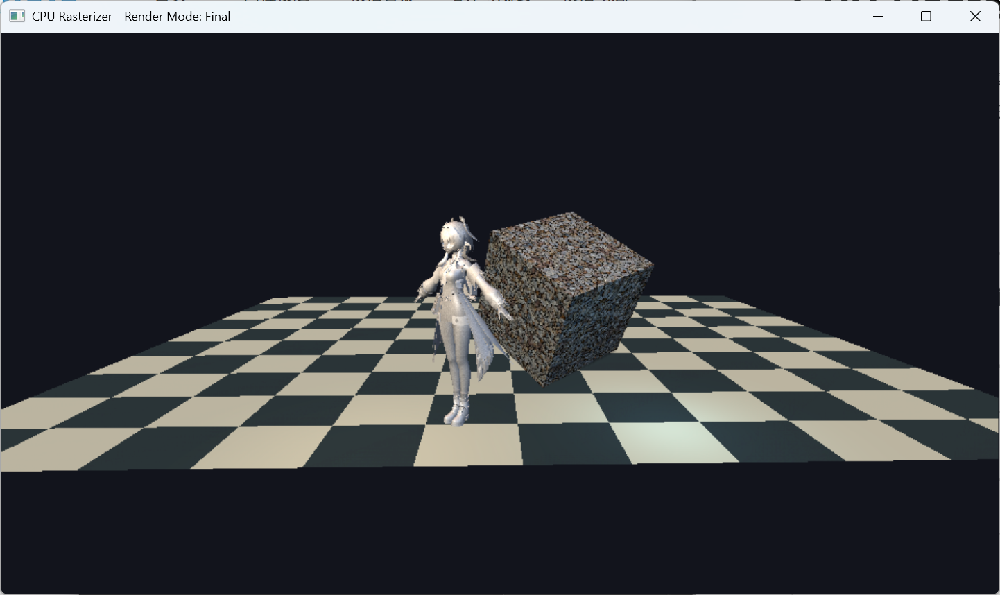
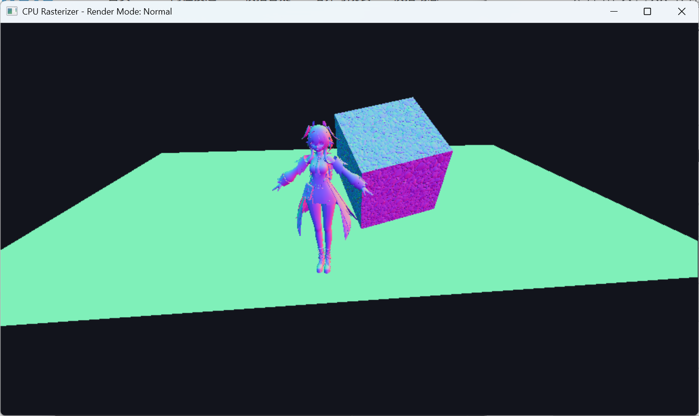
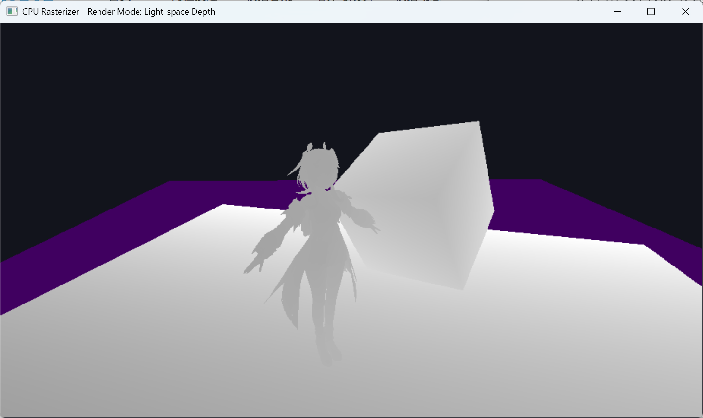

# CPU Rasterizer

一个使用 C++20 从零实现的纯 CPU 软件光栅化渲染器。项目重点不是调用现成图形 API，而是完整拆解并实现现代渲染管线中的关键环节：窗口显示、帧缓冲、顶点变换、视锥裁剪、三角形光栅化、深度测试、透视校正插值、纹理采样、法线贴图、多光源着色与阴影映射。

## 项目预览

### 最终渲染

展示材质、纹理、多光源、模型加载与最终着色效果。



### 法线调试

展示观察空间法线与 Normal Mapping 带来的像素级法线扰动。



### 调试视图合集

展示 Albedo、Depth、UV、Light-space Depth 等渲染中间结果，便于定位纹理坐标、深度和光照空间问题。



## 项目亮点

- 纯 CPU 渲染管线：从顶点处理到像素着色全部在 CPU 侧完成，不依赖 Direct3D/OpenGL/Vulkan。
- Win32 窗口与帧缓冲：支持窗口尺寸变化、BGRA 像素缓冲显示、深度缓冲和全屏切换。
- 完整三角形管线：包含齐次裁剪、背面剔除、屏幕空间包围盒、重心坐标光栅化和逐像素深度测试。
- 透视校正插值：对 UV、法线、切线、世界坐标和观察空间坐标进行透视校正，保证纹理和光照结果稳定。
- 材质与纹理系统：支持 ambient/diffuse/specular 参数、JPEG/PNG 纹理加载、缺失资源时自动生成棋盘格备用纹理。
- Normal Mapping：根据 UV 自动生成切线空间，在像素阶段采样 normal map 并参与光照计算。
- 多光源着色：实现环境光、方向光、点光源、Lambert 漫反射和 Blinn-Phong 高光。
- Shadow Mapping：在 CPU 侧生成主方向光深度图，支持 constant bias、slope-scale bias 和 3x3 加权 PCF 软阴影。
- OBJ 模型加载：支持 Wavefront OBJ 的位置、UV、法线、负索引和多边形三角化。
- Debug Views：通过数字键切换 Albedo、Normal、Depth、UV、Shadow Factor、Light、Light-space Depth 等调试视图。

## 核心技术实现

- 顶点到屏幕空间转换：实现 Model/View/Projection 变换、齐次除法、视口映射和观察空间属性传递。
- 视锥裁剪与三角形光栅化：在齐次裁剪空间裁剪三角形，再使用屏幕空间包围盒和重心坐标逐像素填充。
- 透视校正与像素着色：基于 `1/w` 对 UV、法线、切线和坐标进行校正插值，并完成纹理、材质、法线贴图和多光源计算。
- 阴影与调试视图：生成光源空间深度图，结合 bias 与 PCF 计算软阴影，并提供多种中间结果视图辅助验证。

## 技术栈

- 语言：C++20
- 构建：CMake
- 平台：Windows / Win32 API
- 图像解码：Windows Imaging Component
- 核心方向：CPU Rasterization、Software Rendering、Real-time Rendering Fundamentals

## 项目结构

```text
.
├── CMakeLists.txt
├── README.md
├── docs/images/          # README 展示截图
├── res/
│   ├── Model/            # OBJ 模型资源
│   └── Texture/          # diffuse / normal 纹理资源
└── src/
    ├── core/             # Application、Camera、Framebuffer
    ├── math/             # 向量、矩阵和基础数学函数
    ├── platform/         # Win32 窗口、输入和帧缓冲提交
    ├── renderer/         # 光栅化、材质、纹理、OBJ 加载
    └── scenes/           # 默认测试场景和 Draw Command 组织
```

## 管线流程图

```mermaid
flowchart LR
    A["场景与 Draw Command"] --> B["顶点变换 MVP"]
    B --> C["视锥裁剪"]
    C --> D["透视除法与视口映射"]
    D --> E["背面剔除与包围盒扫描"]
    E --> F["重心坐标光栅化"]
    F --> G["透视校正插值"]
    G --> H["深度测试"]
    H --> I["纹理 / Normal Map / 光照"]
    I --> J["Shadow Mapping 与 PCF"]
    J --> K["写入帧缓冲"]
    K --> L["Win32 窗口显示"]
```



## 功能展示

| 模式 | 按键 | 说明 |
| --- | --- | --- |
| Final | `1` | 最终渲染结果，包含材质、纹理、多光源、Blinn-Phong 高光与阴影 |
| Albedo | `2` | 展示纹理采样、顶点颜色与材质 diffuse 共同得到的基础颜色 |
| Normal | `3` | 将观察空间法线映射到 RGB，用于检查法线与 normal map |
| Depth | `4` | 展示当前相机视角下的 NDC 深度 |
| UV | `5` | 将 UV 坐标映射为颜色，用于检查纹理坐标 |
| Shadow Factor | `6` | 展示 bias 和 PCF 后的阴影因子 |
| Light | `7` | 使用白色表面展示纯光照响应 |
| Light-space Depth | `8` | 展示像素投影到主方向光空间后的深度 |

## 我实现了什么

这个项目重点体现：

- 该项目主要用于加深对 GPU 渲染管线底层机制的理解，包括顶点处理、裁剪、光栅化、插值、深度测试、像素着色和调试视图设计，为后续学习 OpenGL / DirectX / Vulkan 和游戏引擎渲染模块打基础。
- 熟悉矩阵变换、裁剪空间、重心插值、深度缓冲、切线空间和光照模型。
- 能处理实际工程中的资源加载、窗口交互、异常保护和调试视图设计。
- 能将渲染效果拆解为可验证的中间视图，便于定位 UV、法线、深度和阴影问题。

## 场景与资源

默认场景会加载以下资源：

- `res/Texture/Frosted Metal Texture.jpeg`
- `res/Texture/Cobblestone_pavement_texture.jpeg`
- `res/Texture/Cobblestone_pavement_normal_texture.png`
- `res/Model/Linnea.obj`

OBJ 模型可以放在：

- `res/Model`
- `res/Models`

加载器会读取找到的第一个 `.obj` 文件，并将模型归一化到适合当前场景的尺寸。如果没有可用 OBJ，程序会回退到内置球体与立方体场景。

## 操作说明

| 输入 | 功能 |
| --- | --- |
| `W` / `S` | 前进 / 后退 |
| `A` / `D` | 左移 / 右移 |
| `Q` / `E` | 下移 / 上移 |
| `Space` | 上移 |
| `Shift` | 加速移动 |
| 方向键 | 旋转视角 |
| 鼠标右键拖拽 | 旋转视角 |
| `F11` / `Alt+Enter` | 切换全屏 |
| `1` 到 `8` | 切换 Render Mode / Debug View |

## 构建与运行

```powershell
cmake -S . -B build
cmake --build build --config Release
.\build\Release\CPURasterizer.exe
```

Debug 版本也可以运行，但复杂模型、视锥裁剪、Shadow Mapping 和 PCF 阴影采样都在 CPU 上完成，查看完整场景时建议优先使用 Release 构建。

```powershell
cmake --build build --config Debug
.\build\Debug\CPURasterizer.exe
```

## 后续规划

- 接入 ImGui 调试面板，支持实时调整渲染模式、光源参数、阴影 bias 与 PCF 设置。
- 增加 FPS、帧耗时、三角形数量、Shadow Pass / Main Pass 耗时等性能统计，用于分析 CPU 渲染瓶颈。
- 优化光栅化阶段性能，包括背面剔除、包围盒扫描、Shadow Map 分辨率控制和 PCF 采样开关。
- 完善材质与色彩处理，加入 Gamma Correction、Tone Mapping，并尝试实现简化 PBR 材质模型。
- 探索 Tile-based Rasterization 与多线程渲染，提高复杂模型和高分辨率场景下的渲染性能。

## 项目边界

当前版本聚焦于学习和展示 CPU 光栅化管线，因此没有接入 GPU 图形 API，也没有做大型引擎架构封装。
